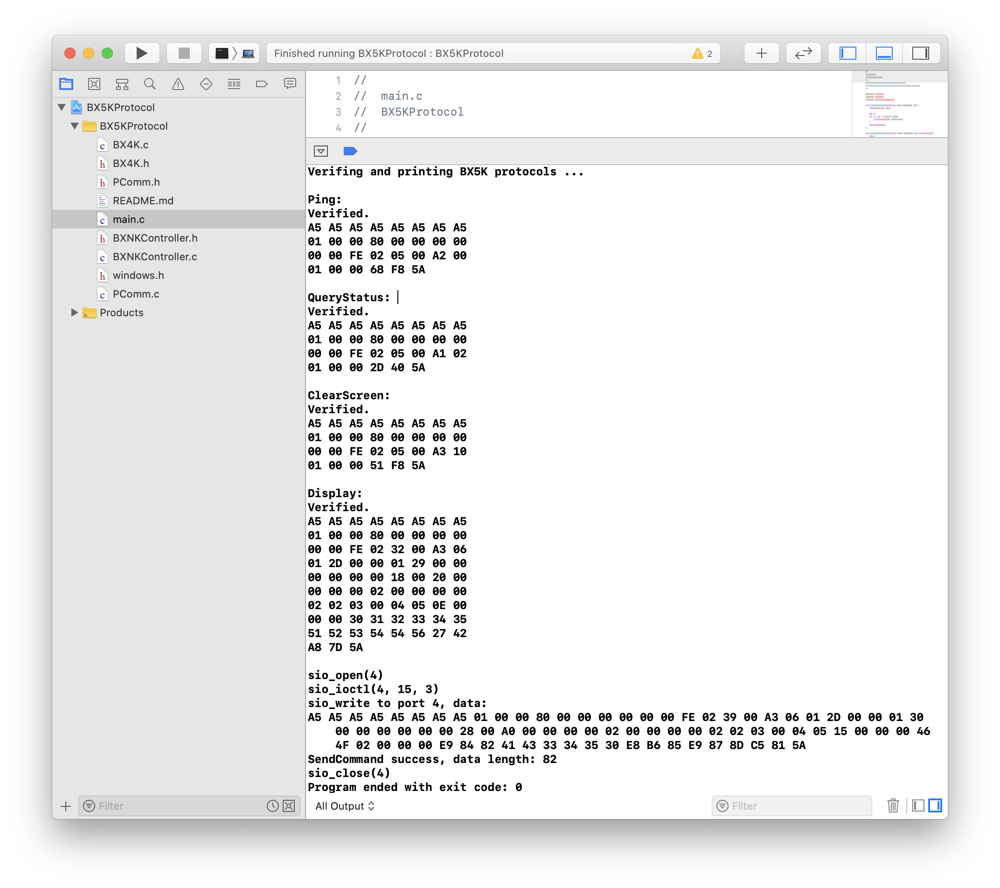

# BX5K 协议生成器

本项目为仰榜科技 BX-5K 系列的 C 语言第三方实现，目前写串口功能使用 `PComm` 库，仅支持 Windows 平台。协议内容的生成是不限平台的。



## 已完成的功能

* 协议数据直接写入串口
* 实现部分命令的协议解析，具体见下文
* 实现协议的基本结构，包括添加帧头帧尾，生成包头，生成CRC 16校验等，相关的结构体与宏定义可以很方便的进行复用，继续实现其他命令

### 已完成的命令

* Ping
* 查询状态
* 清屏
* 发送实时动态区域数据（包括中文字库处理等）

## 未完成的功能

* 解析协议（字节形式）为可读的结构体，对应的拆帧与校验功能

## 调用实例

**中文默认使用 GB2312 编码，其他编码需要定制**

```
//=== Generate display command ===
BYTE chStr[] = "鄂AC3450超重";
ByteArray ch = {
    (sizeof(chStr) / sizeof(BYTE)) - 1, //减去 \0
    chStr
};
//中文编码配置
BX5KFontConfig fontConfig = {
    LANGUAGE_CHINESE, //中文
    ENCODING_UNICODE, //Unicode 编码
    FONT_SONG_TI,     //宋体
    FONT_SIZE_16      //字体大小16（最小）
};
//区域长宽配置
BYTE areaCustomConfig[4] = {
    0x28, 0x00, //宽度 单位8像素点 小端法 0x0028 = (2*16+8*1)*8 = 320
    0xA0, 0x00, //高度 单位1像素点 小端法 0x00A0 = (10*16+0*1)*1 = 160
};
ByteArray displayCommand = display(wrapText(ch, fontConfig), areaCustomConfig);
//printForDebug("协议内容(鄂AC3450超重)", displayCommand);

//=== Send command through serial port ===
ret = sendCommand(port, displayCommand);

//For test
if(ret >= 0) {
    printf("SendCommand success, data length: %d\n", ret);
} else {
    printf("SendCommand error: %d\n", ret);
}

close(port);
```

## 编译处理

本项目开发时使用 Xcode ，所以在项目中添加了 `windows.h` 和 `PComm.c`，主要用于在 OSX 上继续使用 Xcode 的类型检查以及编译功能。

### 在 Windows 平台使用

* 去掉 `windows.h` 和 `PComm.c` 这两个文件
* 修改 `PComm.h` ：

```
//#include <windows.h>
//#include <windowsx.h>
#include "windows.h"
```

改为

```
#include <windows.h>
#include <windowsx.h>
//#include "windows.h"
```

* 添加 `PComm.dll`

#### Makefile

```
all:
    gcc -Wall main.c BXNKController.c BX4K.c -L . -lpcomm -o BX5KExample.exe
clean:
    rm BX5KExample.exe
```
